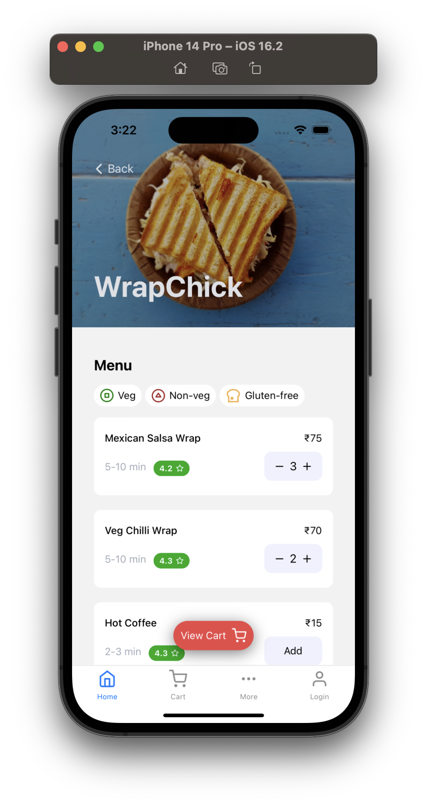
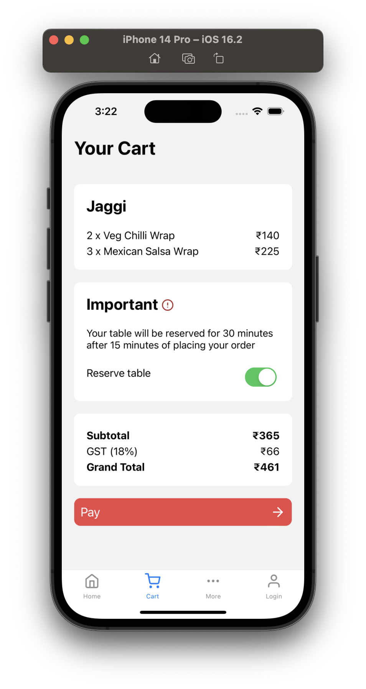
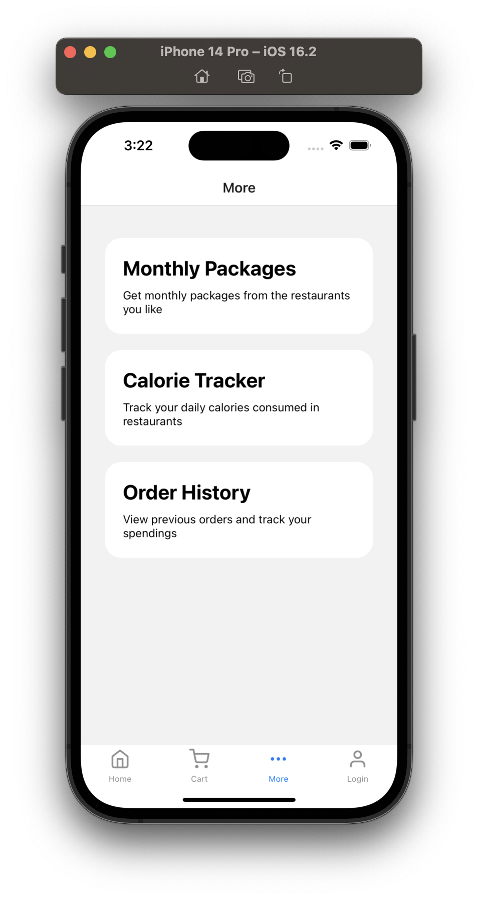
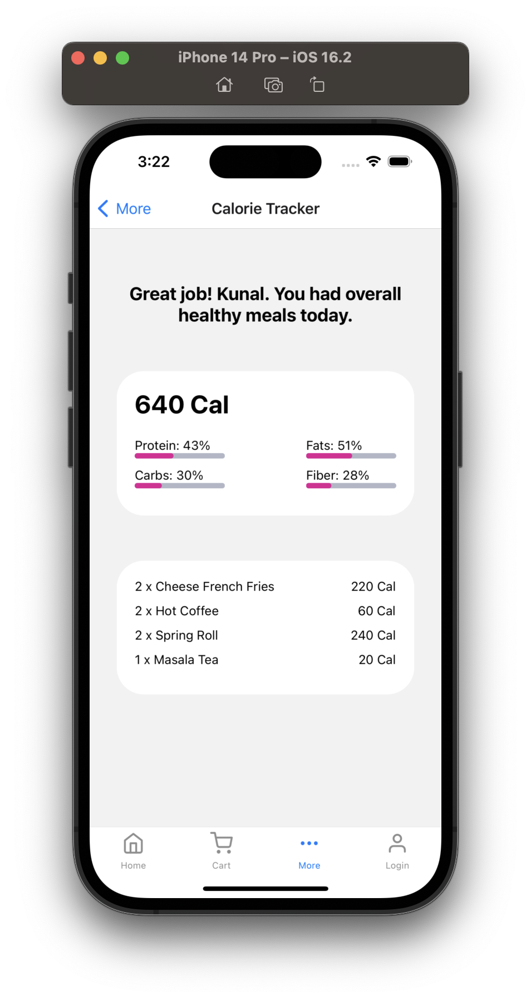

<aside>
A central food payment app that provides students, faculty, and staff hassle-free ways to pay for their meals in the university's mess, restaurants, and cafes.

</aside>

With Bite., you can easily **pay for your food** using your **phone**, **track** your spending, and view your **transaction history**. The app also offers **rewards** and **discounts** to **incentivize** users to choose healthy and sustainable food options.

  

# Features

1. **Monthly Meal Plans with Discounts & Offers**: A feature in Campus Bites that provides discounts and special offers on monthly meal plans for students, faculty, and staff. Users can select from various meal plans to fit their needs and preferences and enjoy discounts in addition to the already-affordable prices. This feature is ideal for those who frequently dine on campus and want to save money while eating delicious and healthy meals.
2. **Order Ahead**: A feature that allows users to place an order in advance and skip the line when they arrive at the dining facility.
3. **Menu Information**: A feature that provides users with the daily menu, including information on ingredients and allergens.
4. **Special Diet Options**: A feature that helps users with special dietary needs, such as vegetarian, vegan, gluten-free, and others, to easily find meals that meet their requirements.
5. s: A feature that promotes sustainability by offering incentives for users who choose eco-friendly options, such as reusable containers, or who reduce food waste by taking only what they can eat.
6. **Nutrition Information**: A feature that provides users with nutritional information for each meal, including calorie counts and macronutrient ratios.
7. **Dining Hall Locations**: A feature that provides users with the location and hours of operation for each dining hall, restaurant, and cafe on campus.
8. **Push Notifications**: A feature that provides users with real-time updates, such as menu changes, special promotions, and other relevant information.
9. **In-app Payment**: A feature that allows users to make payments directly from the app, eliminating the need to carry cash or cards.
10. **Bill Splitting**: A feature in Campus Bites that enables users to divide their food bill with others. It is convenient for groups who dine together and want to share the cost of their meals. The feature allows users to select the meals and people they want to split the bill with, and the app calculates and divides the total evenly. This feature facilitates social interaction and improves the dining experience.
11. **Table Reservation**: A feature in Campus Bites that enables users to reserve tables at university restaurants and cafes in advance. It saves time and eliminates the hassle of waiting in line or searching for available tables. Users can view available options, select a date, time, and location, and the app confirms the reservation. This feature provides a convenient and stress-free dining experience for students, faculty, and staff.
12. **Loyalty Program:** Reward customers for their loyalty with Campus Bites' Loyalty Program. Earn points for each purchase and redeem them for discounts and special offers. Stay informed about the latest promotions, special offers, and discounts with real-time notifications tailored to your preferences.

These features can make the dining experience more convenient, informative, and enjoyable for users while also helping to improve the overall quality of the university's dining services.

# Screenshot
 |
 |

# Next Step
Deadline: 15:00

- [x]  Create Presentation (Mayank, Gautam)
- [x]  Figma Prototype (Anshul, Ojas)
- [x]  Splash Screen
